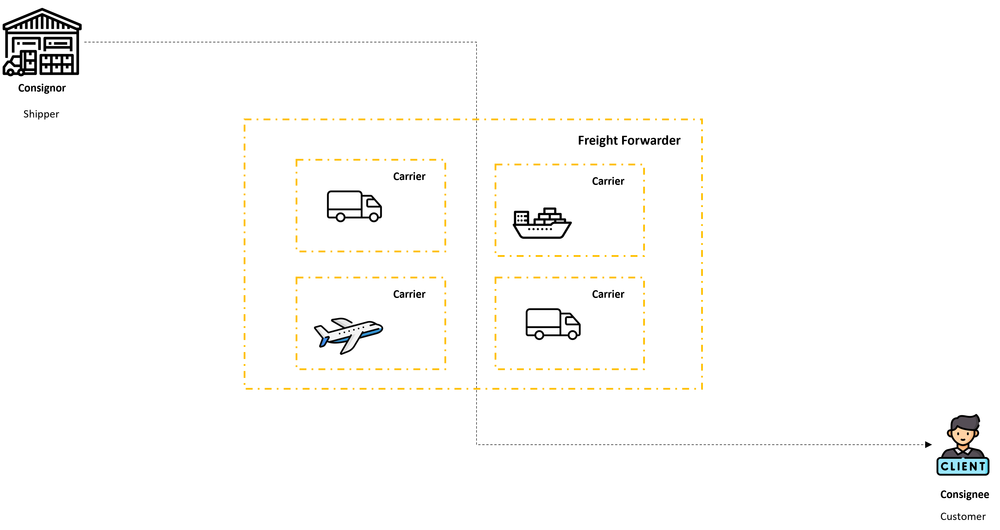
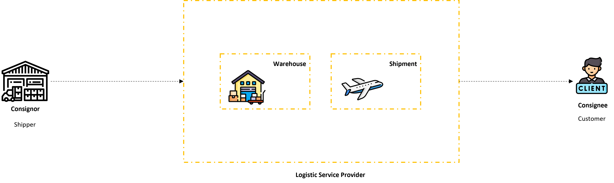
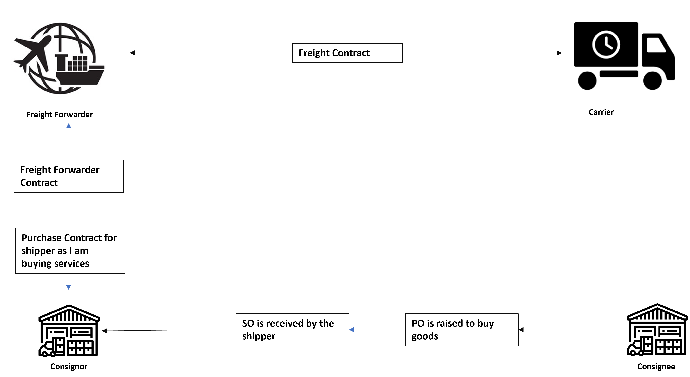

## Parties

### **Shipper**
The person responsible for shipping the goods.

### **Consignor**
The person who is sending the products.

> Both terms appear similar and are often used interchangeably.

---

We can also become the **consignee** in case a customer returns an ordered product.  
In this scenario, **we are the consignee** and the **customer becomes the consignor**.

Likewise, when a vendor sends you a product, **you become the consignee**, and the **vendor is the consignor**.

---

### **Customer**
The person who ordered the product.

### **Consignee**
The person who receives the product.

---

### **Carrier**
The party responsible for picking up and delivering the goods to the customer.  
In other words, they provide transportation services.

#### **Why Carriers Are Required**
- It is very costly for a business to own and manage all transportation.
- Carriers are businesses that operate in specific regions and can handle shipments efficiently.

---

### **Freight Forwarder**
Freight forwarders are businesses that help arrange carriers for transportation.

#### **Why Freight Forwarders (or Freight Providers) Are Important**
- Different regions have different carriers.
- It is difficult for a business to know all the carriers across regions.
- Freight forwarders help plan your transportation, so you don't need to worry about specific carriers in each region.

> In this model, the **shipper contracts with a freight forwarder**, who then arranges appropriate carriers — whether for road, air, or ocean transport.  
> They also support **multi-leg shipments**, managing complex transportation routes seamlessly.

---

### **LSP: Logistic Service Provider**
- LSP provide full logistic services.
- They are more advanced and you just need to provide goods to them and they will take care of storing and delivering the goods.
- SAP can be implemented for LSP secnario as well.

## Relations

Here consignee will raise a PO(Purchase Order) and it will come to the consignor as SO(Sales Order) as customer is buying goods and consignor is selling the goods. Also the freight forwarder will be selling services and we will be buying services so we will raise a PO for them. 
