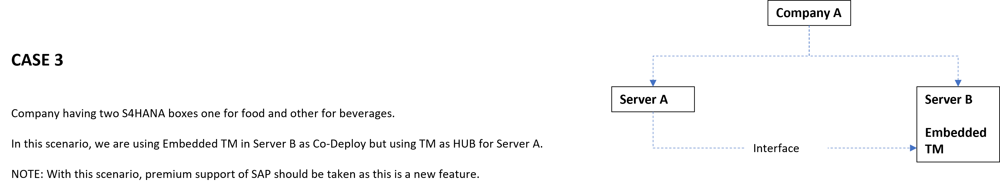

## Journey of SAP TM

### SAP TPVS
- First Solution
- Discontinued product 

### SAP LE
- SAP Logistic Execution which contains a Transportation Solution.
- It has two parts: Warehouse Management, SAP LE-TRA
- LE-TRA will be discontinued in 2030 and SAP TM will be used in near future

***LE-TRA** also known as shipment module

- Available in both ECC & S4hana
- LE-TRA is renamed as classic transportation
- LE-TRA is a seperate object and SAP TM is seperate object and share no common code base.

### TM
- Future product after LE-TRA

**Transition from LE-TRA to TM**

- With ECC clients used LE-TRA and with the transition to S4HANA SAP introduced embedded TM
- But TM comes with advanced functionalities which requires liscense.
- So SAP chunked SAP TM into two parts
- Part 1: Classic TM/Basic Shipment which had same features as LE-TRA and is free.
- Part 2: Advanced TM/Advanced Shipment which requires liscense.

---

### Standalone TM
- TM hosted on seperate box also known as TM as HUB

### SAP S/4Hana Embedded TM
- Embedded product in SAP S4Hana

**Deployment Options available**
1. Standalone TM
2. Embedded TM in S4HANA

- With ECC, SAP started their journey with seperate SCM box which had TM solution along with EWM, APO in standalone box.
- With S4Hana, TM is integrated.
- With standalone, extra monitoring activities are required as data from ECC has to be moved to TM and vice versa.
- But in some secnarios standalone TM is required. Check examples below.

In **Case 1** three boxes were in same country and can be of different businesses like food, consumner goods, beverages. So if we plan a single box, same shipment can be used to transport multiple goods for common customers in same region.

But, in **Case 2** very few cases would be there to find common transport regions or customers in three different countries.

Major number of shipments will be in same country so the major target would be to optimize the transport in the same region.

In **Case 3** we can have embedded TM as Co-deploy for one and Hub for another but this can cause issues in upgrade. For example if some feature of TM requires an upgrade, the whole system needs to be upgraded. Also this is a new feature from 1909 where S4Hana as embedded can also be used as Hub, so extra care is needed.

