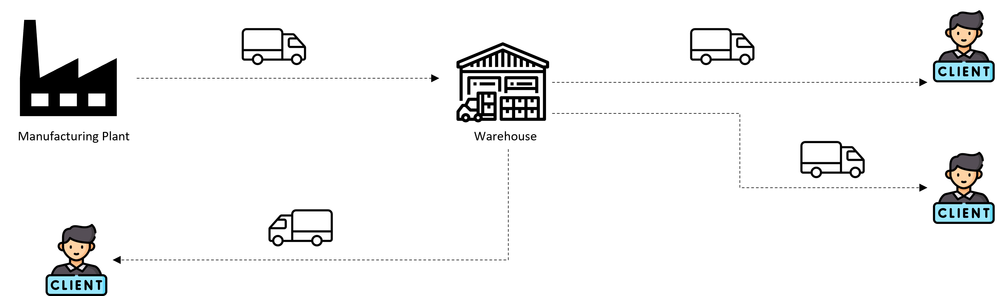

Planning and optimization is required to optimize the use of the resources used in transportation. 
It can help to reduce the cost.

### Products in Market for Transportation Planning
1. Oracle TM
2. SAP TM
2. Blue yonders TMS
3. Mercury Gate TMS

### **SAP TM**
 - Earlier it was called TPVS (Transport Planning Vechicle Scheduling) which was not a huge success.
 - But with SAP S4Hana embedded TM, product is giving tough competition to other products in market.

